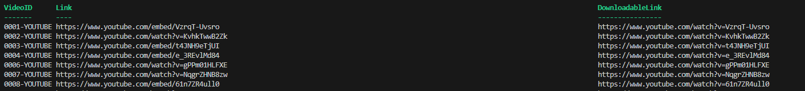
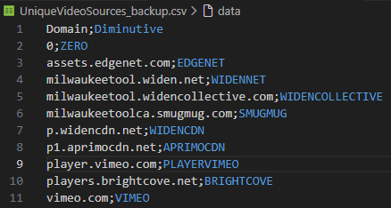

# Increasing referencing by hosting product videos on an owned  YouTube channel 

## Starting point

I have an Excel file containing around 1500 products that have a video link leading to another platform.

- There is a video for French and English products
- Some of the videos are repeated
- Some of the products don't have a video at all
- Most videos are hosted on YouTube , however, they use an embedded link format (but not all of them).
- Some videos come from company-hosted video players
- Some videos either don't exist anymore or are private 

The goal of this project is to :

- Download the videos
- Put an intro segment at the start (with the Brand logo)
- Put an outro segment at the end (with the Brand logo AND the item number)
- Upload all of them on YouTube (unlisted or public)
- Replace the video embed link in the in-house product file

The result will be a better referencing and better brand awareness. 

## Step-by-step

In order to do this project, I anticipate that I will need to do these steps : 

### For the Excel file :

- Clean up the Excel file to remove the junk and make it easier to work with

- Put the data in a CSV file that would have ProductSKU, VLinkEN, VLinkFR and Brand columns

- Create a dictionary that attributes a number for every unique video link

- Create two new value columns in the CSV that take the numbers from the dictionary , in order to know which videos (after editing) to attribute to each item

- Create a list of all unique videos in the list to make a list of videos to download

- For all videos with an embed format, convert them to the regular YouTube video format and add them to a new column

- For all other videos, I'll need to find what background API they're using, then write a PowerShell script adapted to the API it's using.

  

### For the video downloading :

- Make sure that I have enough storage wherever I'm going to download the videos. About 200 GB should be enough.
- See if YouTube Premium truly doesn't allow for local downloads
- Most likely, I'll need to use JDownloader2 or a similar program
- If JDownloader2 accepts a list of video links, great! Use that.
- If it doesn't, either manually put the videos in a playlist or use API requests to create a playlist with those video links. Then, pass the playlist in JDownloader and download all the videos 
- To Do : Does JDownloader accept custom scripts to rename videos ? Renaming the videos with the VideoID ? Afterwards, I can rename them with a PowerShell script from the CSV file. (Maybe do a GET request to YouTube to find the original name of the video to replace)

### For editing the videos : 

- I've found a tool called MoviePy, a Python library that is used for bulk edits of videos. Learn this tool with a select number of videos (maybe 5) 
- Create an outro for each ProductSKU. Rename the outro file to something like ProductSKU_outro
- Then, append the intro, video, and modified outro. Name the file to something like ProductSKU_final

### For uploading onto YouTube :

- The YouTube API allows for uploading videos in bulk and being able to setup information on the video, such as title, description, privacy etc. **However, it is not free.** There is a limit that you will eventually reach, and it will require money.
- In addition, I will need to add the new video link to the CSV.
- Search how much it will cost for uploading specifically. The rest of the operations are optional, but the upload will be the priciest and most important.

### For changing the in-house product file : 

- Create a new CSV file that will only have the ProductSKU, VideoLinkEN, VideoLinkFR
- Pass it into in-house program import.

Then finally, it's **done**. The result is around 2000 videos on your own YouTube channel that are referencing to the website embedded videos.

## Walkthrough

This is what I have done and researched for this project.

First off, I downloaded the Excel file and cleaned it up. Also, created a backup of it, in case the modifications go wrong.

### Removing duplicate links and attributing a VideoID

If we look closely at the video links, there are many duplicates. Since we don't want to download the same video multiple times, we can filter through all the videos to only give one link, then give an ID to better represent what video it is and where it came from. The algorithm goes as such : 

- The script searches for LinkFROriginal

- The script sees a link to a video 

- The script checks in a newly created dictionary if the video link is already in the list

- If it isn't in the list, add a new key pair for the link and the VideoID. The VideoID's format is "0000-SRC" (ex. "0001-YOUTUBE" , "0872-WIDENCOLLECTIVE") 

  - The script will then check for a CSV to find the source of every video. (As a prerequisite, find all unique websites and give them a 2-3 letter code, then put in a CSV).  The name of the script is "Create-FilteredLinkSources.ps1"
  - The script will then check if the video link is the same in LinkFROriginal and LinkENOriginal.  ~~That's how it will add the "-EN, -FR, or -BI (for bilingual)" at the end of the VideoID~~ Actually, the language doesn't matter.

- If it is on the list, it passes to the next link in the list

  At the end of the list , we will have a dictionary with all unique videos from the source CSV. We can store that dictionary in another CSV. That way, if we need to do more of this operation in the future, we can simply append the new links to new VideoIDs , while searching if the video doesnt already exist. 

- Then, append the VideoID to the source CSV in either the VideoID-FR or VideoID-EN (or both if bilingual)

Now, we have a list of all unique videos we need to download. 

And we have a VideoID for all links.

**However, these are not the actual links containing the video format we need.** In order to get the actual link for the downloads, we need to do some more steps.

### For YouTube videos

Almost all the YouTube links are embed links. Embed links do not work for downloading with tools such as JDownloader2. 

Fortunately, changing an embed to a normal youtube video is simple.

- Embed link structure : "https://www.youtube.com/embed/FUCQo_wYR4s"
- Youtube video link structure : "https://www.youtube.com/watch?v=FUCQo_wYR4s"

All we need to do is use a regex that get the ID at the end of the embed "FUCQo_wYR4s" and append it at the end of ""https://www.youtube.com/watch?v="

Once we have this new link, append it to the VideoID CSV file under the "DownloadableLink" column.  

The result is this : 

508 of 685 are YouTube videos.  So 177 of 685 come from somewhere else.

### For the non-YouTube links

There are 9 non-YouTube video sources :

Here are the methods used for each of them. All of them will be stored in ConvertTo-DownloadableLink.ps1

##### Widen-Collective , WidenNet

Using "Invoke-WebRequest -Uri "link" -OutFile , we are granted the HTML of a webpage.  

In that result, we can observe a script containing JSON formatted data called window.bootstrapData. The one we're interested in is "files : label 1080p : source". It gives a link to a clean video link. Using another Invoke-WebRequest on that link results in a pure .mp4 video file.

56 of 177 are Widennet. 2 of 177 are Widencollective.

##### Smugmug

There's around 20 videos and there's a button to download them in full quality. It doesn't warrant using code.

And it's done!

##### Edgenet

They are already ready-to-download links. However, some links are dead. About 80 videos.

On a second look, the links aren't dead, they just have a double-slash after the domain instead of a regular slash. Using a regex, they're removed, and downloaded. All the links work, so 80 videos are downloaded.

##### Widencdn, Aprimocdn, and Brightcove

There's a single source from all three and none work. Disregard.

##### Vimeo and PlayerVimeo

There are 3 videos on Vimeo, and most likely they can be downloaded with JDownloader2.

### 

