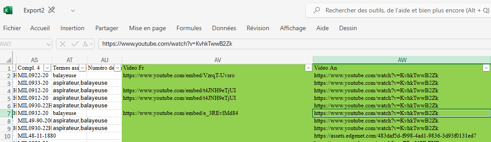

# Increasing referencing by hosting product videos on an owned  YouTube channel 

## Starting point

I have an Excel file containing around 1500 products that have a video link leading to another platform.

- There is a video for French and English products
- Some of the videos are repeated
- Some of the products don't have a video at all
- Most videos are hosted on YouTube , however, they use an embedded link format (but not all of them).
- Some videos come from company-hosted video players
- Some videos either don't exist anymore or are private 

The goal of this project is to :

- Download the videos
- Put an intro segment at the start (with the Placide logo)
- Put an outro segment at the end (with the Placide logo AND the item number)
- Upload all of them on YouTube (unlisted or public)
- Replace the video embed link in the WinDev product file

This is in an attempt to have better referencing...somehow? I'm not too sure how that works, but I don't ask questions and just do what's asked.

## Step-by-step

In order to do this project, I anticipate that I will need to do these steps : 

### For the Excel file :

- Clean up the Excel file to remove the junk and make it easier to work with

- Put the data in a CSV file that would have ProductSKU, VLinkEN, VLinkFR and Brand columns

- Create a dictionary that attributes a number for every unique video link

- Create two new value columns in the CSV that take the numbers from the dictionary , in order to know which videos (after editing) to attribute to each item

- Create a list of all unique videos in the list to make a list of videos to download

- For all videos with an embed format, convert them to the regular YouTube video format and add them to a new column

- For all other videos , **I have no idea.** I'll need to find what background API they're using, and by some miracle maybe it'll all be the same one and it'll be easy.

  

### For the video downloading :

- Make sure that I have enough storage wherever I'm going to download the videos. About 200 GB should be enough.
- See if YouTube Premium truly doesn't allow for local downloads
- Most likely, I'll need to use JDownloader2 or a similar program
- If JDownloader2 accepts a list of video links, great! Use that.
- If it doesn't, either manually put the videos in a playlist or use API requests to create a playlist with those video links. Then, pass the playlist in JDownloader and download all the videos 
- ...how am I going to differentiate between videos? Does JDownloader accept custom scripts to rename videos ? maybe renaming the videos with the watch_ID ? so afterwards, I can rename them with a PowerShell script from the CSV file?

### For editing the videos : 

- I've found a tool called MoviePy, a Python library that is used for bulk edits of videos. Learn this tool with a select number of videos (maybe 5) 
- Create an outro for each ProductSKU. Rename the outro file to something like ProductSKU_outro
- Then, append the intro, video, and modified outro. Name the file to something like ProductSKU_final

### For uploading onto YouTube :

- The YouTube API allows for uploading videos in bulk and being able to setup information on the video, such as title, description, privacy etc. **However, it is not free.** There is a limit that you will eventually reach, and it will require money.
- In addition, I will need to add the new video link to the CSV.
- Search how much it will cost for uploading specifically. The rest of the operations are optional, but the upload will be the priciest and most important.

### For changing the WinDev product file : 

- Create a new CSV file that will only have the ProductSKU, VideoLinkEN, VideoLinkFR
- Pass it into WinDev import.

Then finally, it's **done**. You have around 2000 videos on your own YouTube channel that are referencing from your own website embedded videos.

## Walkthrough

This is what I have done and researched for this project.

First off, I downloaded the Excel file and cleaned it up. Also, created a backup of it, in case the modifications go wrong.

